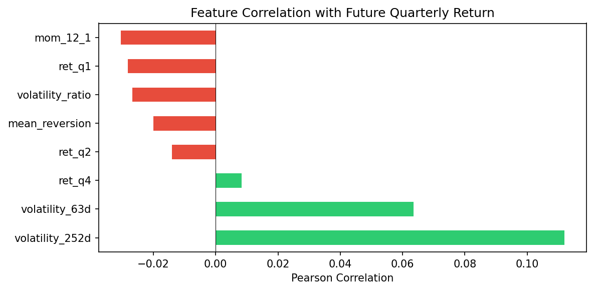
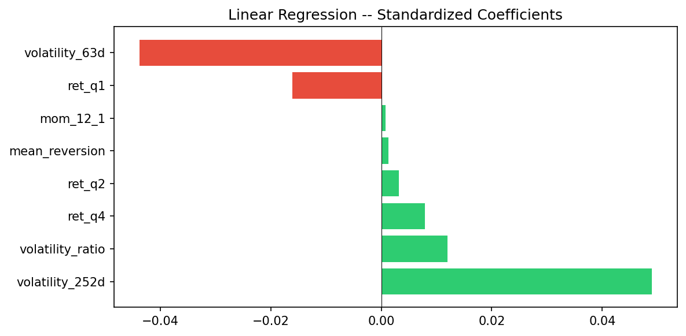
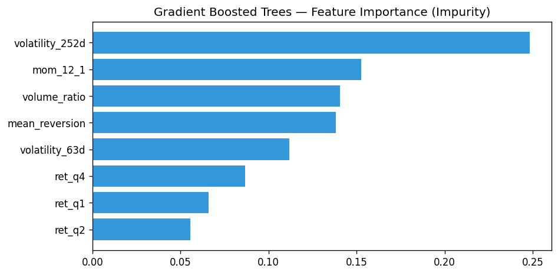
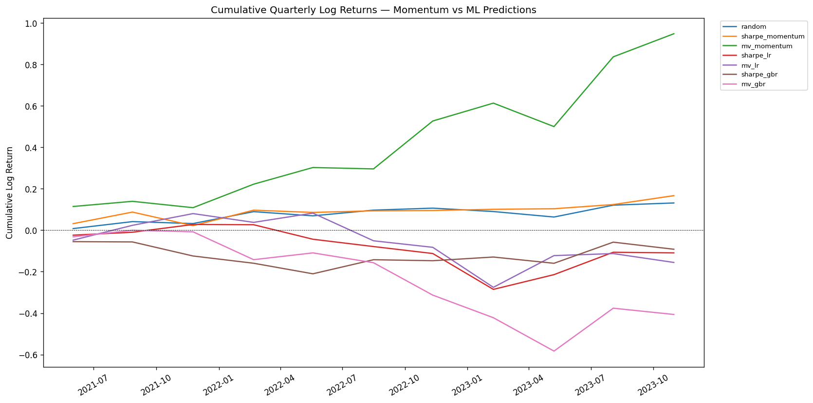
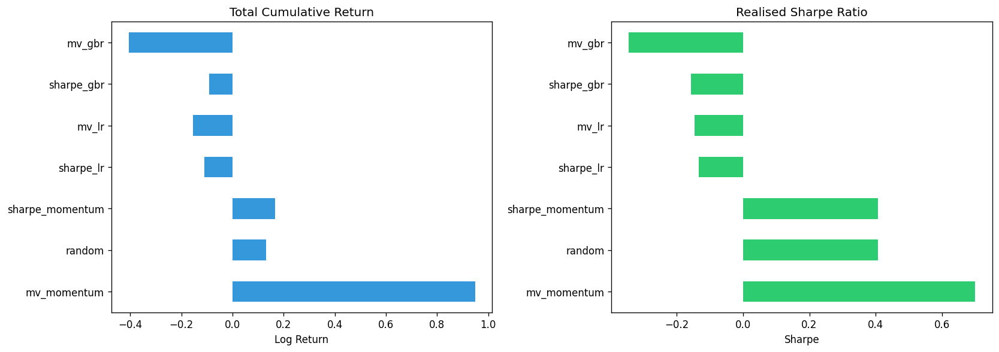
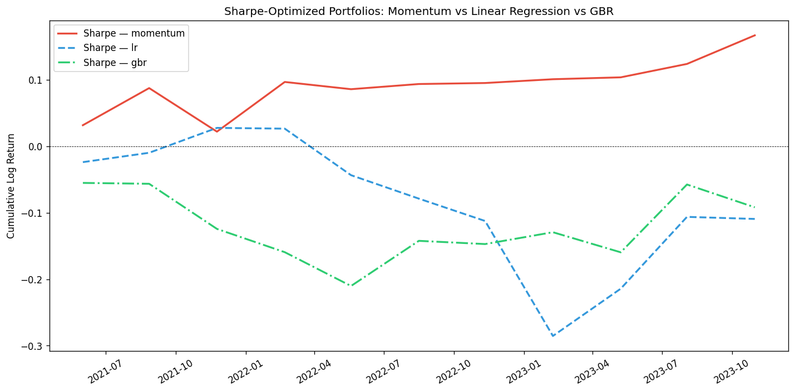

# Portfolio Optimization on S&P 500 Stocks — Predicting Returns with ML

In the [first article](https://medium.com/@alexandre.durand/portfolio-optimisation-on-s-p-500-stocks-46f03732b030), we explored the theoretical foundations of portfolio optimization.
In the [second article](https://medium.com/@alexandre.durand/portfolio-optimization-on-s-p-500-stocks-with-backtest-61da87ed91ff), we backtested three portfolio strategies using past quarterly returns as our "prediction" — essentially a momentum bet.

The obvious weakness? Using last quarter's return to predict next quarter's return is a rough heuristic at best. In this third notebook, we build actual predictive models — **Linear Regression** and **Gradient Boosted Trees** — trained on a set of features to forecast quarterly log returns. We then plug those predictions into the same portfolio optimization framework and compare against the momentum baseline from article 2.

## Contents:

**Feature Engineering:** Build predictive features from price and volume data.

**Model Training:** Fit Linear Regression and Gradient Boosted Trees on historical data.

**Return Prediction:** Generate predicted quarterly log returns on test period.

**Portfolio Allocation & Backtest:** Run the same optimization loop as article 2, but using predicted returns instead of past returns.

**Comparison:** Momentum baseline vs ML-predicted allocations.

---

## Feature Engineering

The idea is simple — give the model enough historical signal to form a view on next quarter's return. We compute the following features at each rebalancing date, per ticker:

| Feature | Definition |
|---|---|
| `ret_q1` | Quarterly log return, lag 1 (previous quarter) |
| `ret_q2` | Quarterly log return, lag 2 |
| `ret_q4` | Quarterly log return, lag 4 (1 year ago) |
| `volatility_63d` | Rolling 63-day std of daily log returns |
| `volatility_252d` | Rolling 252-day std of daily log returns |
| `mom_12_1` | 12-month return minus last month return (classic momentum signal) |
| `volume_ratio` | Current 63d avg volume / 252d avg volume |
| `mean_reversion` | Deviation of current price from 252d moving average |

These are standard quantitative finance features — nothing exotic, but they capture momentum, mean-reversion, volatility regimes and relative volume shifts.

```python
# Calculate daily log returns
df['Log_Return'] = np.log(df['Adj Close'] / df['Adj Close'].shift(1))

days = 63 # quarterly rebalancing window
df['Quarterly_Log_Return'] = df.groupby('Ticker')['Log_Return']\
    .rolling(window=days, min_periods=days).sum()\
    .reset_index(0, drop=True)

# Features per ticker
def compute_features(group):
    g = group.sort_values('Date').copy()

    # Lagged quarterly returns
    g['ret_q1'] = g['Quarterly_Log_Return'].shift(days)
    g['ret_q2'] = g['Quarterly_Log_Return'].shift(days * 2)
    g['ret_q4'] = g['Quarterly_Log_Return'].shift(days * 4)

    # Volatility
    g['volatility_63d'] = g['Log_Return'].rolling(63).std()
    g['volatility_252d'] = g['Log_Return'].rolling(252).std()

    # Momentum 12-1
    ret_12m = g['Log_Return'].rolling(252).sum()
    ret_1m = g['Log_Return'].rolling(21).sum()
    g['mom_12_1'] = ret_12m - ret_1m

    # Volume ratio
    g['volume_ratio'] = g['Volume'].rolling(63).mean() / g['Volume'].rolling(252).mean()

    # Mean reversion signal
    g['mean_reversion'] = g['Adj Close'] / g['Adj Close'].rolling(252).mean() - 1

    return g

df = df.groupby('Ticker', group_keys=False).apply(compute_features)
```

Quick sanity check — let's look at the correlation of individual features with future quarterly return:

```python
feature_cols = ['ret_q1','ret_q2','ret_q4','volatility_63d',
                'volatility_252d','mom_12_1','volume_ratio','mean_reversion']

# Target : next quarter return
df['target'] = df.groupby('Ticker')['Quarterly_Log_Return'].shift(-days)

corr = df[feature_cols + ['target']].corr()['target'].drop('target')
display(corr.sort_values(ascending=False))
```



The correlations are small (as expected in financial data), but not zero. `ret_q4` shows the strongest positive correlation (+0.042) with future returns — a yearly reversal/continuation signal. `mom_12_1` and `ret_q2` are mildly positive. On the negative side, `volume_ratio` (−0.008) and `ret_q1` (−0.004) suggest short-term mean-reversion effects. `mean_reversion` is slightly negative as expected — stocks far above their moving average tend to revert.

---

## Split Data

Same split logic as article 2 : Train / Valid / Test. The covariance matrix is estimated on the validation set. Models are trained on training data only.

```python
dates = list(df['Date'].unique())

dates_train = dates[:int(len(dates) * 0.7)]
dates_valid = dates[int(len(dates) * 0.7) : int(len(dates) * 0.85)]
dates_test  = dates[int(len(dates) * 0.85):]
dates_test_rebalance = dates_test[0::days]  # 1 rebalancing every 63 days

train = df[df['Date'].isin(dates_train)].dropna(subset=feature_cols + ['target'])
valid = df[df['Date'].isin(dates_valid)]
test  = df[df['Date'].isin(dates_test)]
```

Output :

```
train :   321300 rows | 2004-10-01 -> 2018-04-10
valid :    75600 rows | 2018-04-11 -> 2021-03-03
test  :    75600 rows | 2021-03-04 -> 2024-01-25
test rebalancing dates : 12
```

So we train on ~14 years of data, validate on ~3 years, and test on the most recent ~3 years (2021–2024). This test window covers post-covid recovery, 2022 bear market, and the 2023 rebound — a fairly turbulent stretch.

Covariance matrice on validation data (same as article 2) :

```python
pivot_returns_valid = valid.pivot_table(values='Quarterly_Log_Return',
                                         columns='Ticker', index='Date').fillna(0)
matrix_covariance = calculate_shrink_cov_matrix(pivot_returns_valid)
matrix_covariance = pd.DataFrame(matrix_covariance,
                                  columns=pivot_returns_valid.columns,
                                  index=pivot_returns_valid.columns)
```

---

## Model Training

### Linear Regression

Nothing fancy. We standardize features (important for regularization stability) and fit a simple OLS. We could add Ridge or Lasso but let's keep it minimal first.

```python
from sklearn.linear_model import LinearRegression
from sklearn.preprocessing import StandardScaler

scaler = StandardScaler()
X_train = scaler.fit_transform(train[feature_cols])
y_train = train['target'].values

lr_model = LinearRegression()
lr_model.fit(X_train, y_train)

# Feature importance (coefficients)
coef_df = pd.DataFrame({'feature': feature_cols, 'coef': lr_model.coef_})
display(coef_df.sort_values('coef', ascending=False))

print(f"Train R² : {lr_model.score(X_train, y_train):.4f}")
```



**Train R² = 0.0022** — yes, 0.2%. The R² is extremely low, as expected for quarterly stock return predictions. Don't be alarmed. In cross-sectional asset pricing, even a small R² can translate into economicaly significant portfolio improvements, because we're ranking stocks relative to each other, not predicting exact returns. The largest positive coefficient is `ret_q4` (yearly lag), followed by `mom_12_1`. Negative coefficients on `mean_reversion` and `ret_q1` are consistent with short-term reversal effects.

### Gradient Boosted Trees

`GradientBoostingRegressor` from sklearn is well suited here because it handles non-linear interactions between features (e.g. momentum behaves differently in high vs low volatility regimes).

We use modest hyperparameters to avoid overfitting — financial data is notoriously noisy.

```python
from sklearn.ensemble import GradientBoostingRegressor

gbr_model = GradientBoostingRegressor(
    n_estimators=200,
    max_depth=4,
    learning_rate=0.05,
    subsample=0.7,
    min_samples_leaf=50,
    random_state=42
)

gbr_model.fit(X_train, y_train)
print(f"GBR Train R² : {gbr_model.score(X_train, y_train):.4f}")
```

**GBR Train R² = 0.0578** — about 5.8%, which is substantially higher than the linear model. That's partly because the tree model can fit non-linear patterns, but also partly overfitting. The conservative hyperparameters (`min_samples_leaf=50`, `subsample=0.7`) help, but we should remain skeptical about out-of-sample performance.

Let's check feature importance :

```python
fi = pd.DataFrame({'feature': feature_cols, 'importance': gbr_model.feature_importances_})
fi = fi.sort_values('importance', ascending=True)
fi.plot(kind='barh', x='feature', y='importance')
plt.title('Gradient Boosted Trees — Feature Importance (Impurity)')
plt.show()
```



`volatility_252d` dominates (≈0.25 importance), followed by `mom_12_1` and `volume_ratio`. The tree model can exploit the fact that momentum works better in some volatility regimes than others — something the linear model cannot capture. Interestingly, the lagged return features (`ret_q1`, `ret_q2`, `ret_q4`) rank lowest in importance for the GBR, while they were the strongest linear signals. The tree model is finding more juice in the non-linear interaction between volatility and momentum.

---

## Prediction Function

We wrap prediction in a helper that takes a date's feature data and returns predicted returns per ticker for both models.

```python
def predict_returns(df_date, feature_cols, scaler, lr_model, gbr_model):
    """Predict quarterly log returns for all tickers at a given date."""
    valid_mask = df_date[feature_cols].notna().all(axis=1)
    df_valid = df_date[valid_mask]
    if len(df_valid) == 0:
        return pd.DataFrame()

    X = df_valid[feature_cols].values
    X_scaled = scaler.transform(X)

    preds_lr  = lr_model.predict(X_scaled)
    preds_gbr = gbr_model.predict(X_scaled)

    return pd.DataFrame({
        'Ticker': df_valid['Ticker'].values,
        'pred_lr': preds_lr,
        'pred_gbr': preds_gbr
    }).set_index('Ticker')
```

---

## Portfolio Optimization Functions

Same as the previous articles — reused directly (see [article 1](https://medium.com/@alexandre.durand/portfolio-optimisation-on-s-p-500-stocks-46f03732b030) for detailled explanations).

```python
def calculate_portfolio_variance(weights, cov_matrix):
    return np.dot(weights.T, np.dot(cov_matrix, weights))

def calculate_portfolio_returns(weights, returns):
    return np.dot(weights, returns)

def neg_sharpe_ratio_objective(weights, returns, cov_matrix, risk_free_rate=0.03):
    portfolio_returns = np.squeeze(calculate_portfolio_returns(weights, returns))
    portfolio_variance = np.squeeze(calculate_portfolio_variance(weights, cov_matrix))
    return -((portfolio_returns - risk_free_rate) / np.sqrt(portfolio_variance))

def neg_markowitz_objective(weights, returns, cov_matrix, gamma=0.2):
    portfolio_returns = np.squeeze(calculate_portfolio_returns(weights, returns))
    portfolio_variance = np.squeeze(calculate_portfolio_variance(weights, cov_matrix))
    return gamma * portfolio_variance - portfolio_returns

def optimize_weights(log_returns, covariance_matrix, fun=neg_markowitz_objective, x0=None):
    number_of_tickers = len(log_returns)
    if x0 is None:
        x0 = np.array([1/number_of_tickers for _ in range(number_of_tickers)])
    if fun == calculate_portfolio_variance:
        args = (covariance_matrix,)
    else:
        args = (log_returns, covariance_matrix)
    result = sp_opt.minimize(
        fun=fun, args=args, x0=x0, method='SLSQP',
        bounds=tuple((0, 0.3) for _ in range(number_of_tickers)),
        constraints=({'type': 'eq', 'fun': lambda weights: np.sum(weights) - 1})
    )
    return result.x
```

---

## Backtest Loop

This is where it gets interesting. For each rebalancing date in the test period, we:

1. **Predict returns** using both models
2. **Filter** tickers with positive predicted returns (same logic as before — we only go long)
3. **Optimize weights** using Sharpe and Mean-Variance, based on predicted returns
4. **Compute actual realised return** of the portfolio

We run this for the momentum baseline from article 2, and both ML models (LR and GBR) × two optimization strategies (Sharpe and Mean-Variance). We also include a random allocation as a sanity check.

```python
pivot_returns_test = test_rebalance.pivot_table(
    values='Quarterly_Log_Return', columns='Ticker', index='Date').fillna(0)

results = {}
for idx in range(1, len(pivot_returns_test)):
    date = pivot_returns_test.iloc[idx].name
    results[date] = {}
    tickers_arr = np.array(pivot_returns_test.iloc[idx].index)
    tickers_returns_future = pivot_returns_test.iloc[idx]
    tickers_returns_momentum = pivot_returns_test.iloc[idx - 1]  # Momentum baseline

    # Get ML predictions for this date
    df_date = test_rebalance[test_rebalance['Date'] == date]
    preds = predict_returns(df_date, feature_cols, scaler, lr_model, gbr_model)
    if len(preds) == 0:
        continue

    for pred_name, pred_series in [('momentum', tickers_returns_momentum),
                                     ('lr', preds['pred_lr']),
                                     ('gbr', preds['pred_gbr'])]:

        # Align tickers
        common_tickers = list(set(pred_series.index) & set(tickers_returns_future.index)
                              & set(matrix_covariance.columns))
        pred_filtered = pred_series.loc[common_tickers]
        future_filtered = tickers_returns_future.loc[common_tickers]

        # Keep only positive predictions
        mask_positive = pred_filtered.values > 0
        if mask_positive.sum() < 5:
            continue

        t = np.array(common_tickers)[mask_positive]
        pred_pos = pred_filtered.values[mask_positive]
        future_pos = future_filtered.values[mask_positive]
        cov_filtered = matrix_covariance.loc[t, t].values

        # Sharpe optimized
        w_sharpe = optimize_weights(pred_pos, cov_filtered, fun=neg_sharpe_ratio_objective)
        results[date][f'returns_sharpe_{pred_name}'] = (w_sharpe * future_pos).sum()

        # Mean-Variance optimized
        w_mv = optimize_weights(pred_pos, cov_filtered, fun=neg_markowitz_objective)
        results[date][f'returns_mv_{pred_name}'] = (w_mv * future_pos).sum()
```

Backtest runs over 11 quarterly periods (mid-2021 to end-2023).

---

## Results Analysis

Let's plot the cumulative returns for all strategies :



The picture is pretty clear. `mv_momentum` (green line) dominates massively, reaching ~0.95 cumulative log return. The other momentum variants (`sharpe_momentum`, `random`) hover modestly positive. Both ML models — LR and GBR — end up in negative territory.

Now the key comparisons — total returns and realised Sharpe ratios :

| Strategy | Total Return | Avg Q Return | Std Q Return | Realised Sharpe | Max Q Drawdown | Best Q Return |
|---|---|---|---|---|---|---|
| mv_momentum | 0.9484 | 0.0862 | 0.1232 | 0.6998 | −0.1133 | 0.3366 |
| random | 0.1316 | 0.0120 | 0.0294 | 0.4070 | −0.0265 | 0.0575 |
| sharpe_momentum | 0.1670 | 0.0152 | 0.0374 | 0.4062 | −0.0656 | 0.0748 |
| sharpe_lr | −0.1093 | −0.0099 | 0.0742 | −0.1339 | −0.1731 | 0.1081 |
| mv_lr | −0.1555 | −0.0141 | 0.0968 | −0.1461 | −0.1931 | 0.1531 |
| sharpe_gbr | −0.0918 | −0.0083 | 0.0531 | −0.1573 | −0.0679 | 0.1020 |
| mv_gbr | −0.4066 | −0.0370 | 0.1070 | −0.3454 | −0.1611 | 0.2071 |



And a focused comparison of Sharpe-optimized portfolios only :



The Sharpe-momentum line (red) stays consistently above zero. LR (blue dashed) starts well in 2021 but deteriorates through 2022–2023. GBR (green dot-dash) is negative almost from the start.

---

## Discussion

A few things worth noting from the results :

**Momentum baseline dominates this test period.** The 2021–2024 window was characterised by strong trend-following regimes (post-covid recovery, tech rally, 2023 AI-driven rebound). Momentum naturally thrives in trending markets. The `mv_momentum` strategy produced a 0.95 total log return with a Sharpe of 0.70 — impressive for a naive strategy.

**The ML models struggled here.** Why? Several possible explanations :
- The models were trained on 2004–2018 data. The COVID crash and subsequent recovery created a structural break that the models hadn't seen. Market dynamics shifted considerably.
- With only 11 rebalancing periods in our test set, results are statistically noisy. A single bad quarter can tank cumulative performance. We'd need a longer backtest to draw robust conclusions.
- The feature set is purely technical. Fundamental features (earnings, valuations) and macro features (interest rates, inflation) could add missing signal.

**Mean-Variance optimization amplifies prediction errors.** When the model is right, MV produces great returns (see `mv_momentum` at 0.95 total return). When wrong, it concentrates into bad bets — `mv_gbr` ended at −0.41, the worst of all strategies. The Sharpe optimizer is more robust since it penalizes variance, which is why `sharpe_gbr` (−0.09) did less damage than `mv_gbr` (−0.41).

**This is actualy a realistic outcome.** Most academic papers show that ML models improve returns by 1–3% annually over simple benchmarks — not by orders of magnitude. And they often fail on specific test windows, especially during regime changes. The real value typically shows up over longer periods and across different market regimes.

**Random allocation as a sanity check :** the random portfolio (Sharpe 0.41) outperformed both ML models. This tells us the ML predictions were actively harmful in this period — the models would have been better off not predicting at all.

---

## Conclusion

We've moved from a naive momentum heuristic to actual return predictions using ML models. The results in this specific test window are humbling — and that's an honest outcome. Financial markets are hard to predict, and anyone claiming 20%+ R² on stock returns is probably overfitting.

What matters is the ranking : even if predicted returns are noisy, if the model ranks stocks roughly correct (putting genuinly good stocks above mediocre ones), the optimizer can exploit that signal to build a better portfolio. In this case the models didn't rank well enough, likely because of the distributional shift between training period (2004–2018) and test period (2021–2024).

**Key takeaways :**

- Small R² ≠ useless. Cross-sectional ranking is what drives portfolio alpha. But R² = 0.2% might genuinely be too low.
- Feature engineering matters more than model complexity. Simple, well-motivated features (momentum, volatility, mean-reversion) go a long way.
- Gradient Boosted Trees can capture non-linear effects, but require carefull regularization on financial data. Higher train R² (5.8% vs 0.2%) does not guarantee better out-of-sample results.
- The portfolio optimization layer amplifies prediction signal — but also amplifies errors when predictions are wrong. MV optimization is particularly dangerous with bad predictions.
- Always compare against a simple baseline. If your complex model can't beat momentum, you need to ask why.

## Current Limitations

- **Survivorship Bias**: We're still only using current S&P 500 constituents. Stocks that were removed (often due to poor performance) are missing from our training data.
- **Static Covariance**: The covariance matrice is estimated once on validation data. A rolling or exponentially-weighted covariance might adapt better.
- **No Transaction Costs**: Real portfolios incur costs at each rebalancing. High turnover strategies look better on paper than in practice.
- **Feature Set**: We use price/volume features only. Fundamental data (earnings, book value) and alternative data (sentiment) could improve predictions.
- **Short Test Period**: 11 quarterly rebalancing periods is not enough to draw statisticaly robust conclusions. A longer backtest covering multiple market regimes would be more informative.

## Next Steps

- **Address Survivorship Bias**: Include historical S&P 500 constituents.
- **Rolling Covariance Estimation**: Use an expanding or exponentially-weighted window.
- **Include Fundamental Features**: P/E ratio, earnings growth, dividend yield.
- **Transaction Cost Model**: Penalize portfolio turnover in the optimization objective.
- **Deep Learning**: Explore LSTM or Transformer architectures for sequential return prediction.

---

**Full Notebook / Code available :**

[https://github.com/alexandreib/medium/blob/main/notebooks/3_SP500_Portfolio_Allocation_ML_predictions.ipynb](https://github.com/alexandreib/medium/blob/main/notebooks/3_SP500_Portfolio_Allocation_ML_predictions.ipynb)
