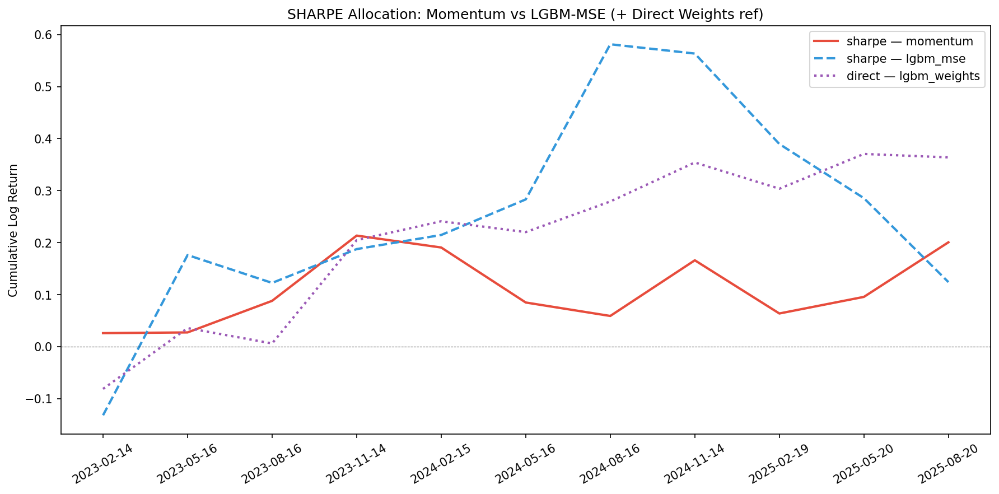

# Portfolio Optimization on S&P 500 — Predicting Allocation Weights Directly

In the [previous article](https://medium.com/@alexandre.durand/portfolio-optimization-on-s-p-500-stocks-with-ml-predictions), we trained ML models (Linear Regression, GBT) to **predict quarterly returns**, then fed those predictions into portfolio optimization. The whole pipeline was: predict returns → filter positive → optimize weights. Two separate stages. The model doesn't know what the optimizer will do with its output, and the optimizer doesnt care how the model was trained.

But is that really optimal? Minimizing MSE on individual stock returns is not the same as producing a good portfolio. A model can be great at predicting large-cap stable stocks (low variance, low alpha) and terrible at the volatile ones that actually drive portfolio performance. The optimizer then has to salvage whatever the model gives it.

In this article, we take a different route — **we train a LightGBM model to predict the optimal portfolio weights directly**. Instead of predicting returns and hoping the optimizer figures it out, we compute what the oracle-optimal Markowitz weights would have been (using hindsight), and train the model to replicate those weights from features. At inference, no optimizer needed — just a forward pass.

We also switch from sklearn's `GradientBoostingRegressor` to **LightGBM** — same idea, ~10x faster, and supports custom objectives which we'll need later.

---

## Data & Features (Same as Article 3)

Same dataset — S&P 500 constituents with 20 years of daily prices. Same 8 features:

| Feature | Definition |
|---|---|
| `ret_q1` | Quarterly log return, lag 1 |
| `ret_q2` | Quarterly log return, lag 2 |
| `ret_q4` | Quarterly log return, lag 4 |
| `volatility_63d` | Rolling 63-day std of daily log returns |
| `volatility_252d` | Rolling 252-day std of daily log returns |
| `mom_12_1` | 12-month return minus last month return |
| `volatility_ratio` | Ratio of 63d / 252d volatility |
| `mean_reversion` | Price deviation from 252d moving average |

If you haven't read [article 3](https://medium.com/@alexandre.durand/portfolio-optimization-on-s-p-500-stocks-with-ml-predictions), check it for the feature definitions and train/valid/test split logic. Same temporal split: 70/15/15.

```python
df = pd.read_csv('../data/sp500_20years.csv')

df['Log_Return'] = df.groupby('Ticker')['Adj Close'].transform(lambda x: np.log(x / x.shift(1)))

days = 63
df['Quarterly_Log_Return'] = df.groupby('Ticker')['Log_Return']\
    .rolling(window=days, min_periods=days).sum()\
    .reset_index(0, drop=True)

feature_cols = ['ret_q1','ret_q2','ret_q4','volatility_63d',
                'volatility_252d','mom_12_1','volatility_ratio','mean_reversion']
df['target'] = df.groupby('Ticker')['Quarterly_Log_Return'].shift(-days)
```

Output:
```
Total rows: 2,518,880
train :  1411253 rows | 2006-02-24 -> 2020-02-14
valid :   379262 rows | 2020-02-18 -> 2023-02-13
test  :   379765 rows | 2023-02-14 -> 2026-02-18
test rebalancing dates : 12
```

We also prepare quarterly-sampled versions of train and valid (one observation per 63 trading days). This gives non-overlapping returns for the weight model:

```
Quarterly train : 22295 rows | 56 dates
Quarterly valid :  5848 rows | 14 dates
```

So ~22K rows for the weight model vs ~1.4M for the return model. Big tradeoff.

---

## LightGBM Baseline — MSE Loss

First, a standard LightGBM regressor trained on the full daily dataset. This replaces `GradientBoostingRegressor` from article 3.

```python
params_mse = {
    'objective': 'regression',
    'metric': 'rmse',
    'learning_rate': 0.05,
    'num_leaves': 31,
    'max_depth': 4,
    'subsample': 0.7,
    'colsample_bytree': 0.8,
    'min_child_samples': 50,
    'random_state': 42,
    'verbose': -1,
}

lgbm_mse = lgb.train(
    params_mse, dtrain_mse,
    num_boost_round=500,
    valid_sets=[dvalid_mse],
    callbacks=[lgb.early_stopping(50), lgb.log_evaluation(50)]
)
```

Best iteration stops around 200 rounds. The RMSE on validation is comparable to what we got with sklearn's GBR. Feature importance shows `volatility_ratio` and `volatility_252d` dominating, similar pattern to article 3.

---

## Direct Weight Prediction — The Idea

The standard approach (articles 2 & 3): predict returns r̂ᵢ, then optimize weights wᵢ given r̂ᵢ and a covariance matrix Σ. Two separate stages that don't talk to each other.

The idea here: **skip the two-stage pipeline entirely**. If we can learn what good allocations look like from historical data, we don't need the optimizer at test time.

### Oracle Weight Targets

For each rebalancing date *t* in the training set, we have access to the realised future returns rᵢ⁽ᵗ⁾ (hindsight — these are the actual returns that happened). We run Markowitz optimization on these realised returns to get the oracle-optimal weights:

> **w*(t) = argmin_w [ γ · wᵀΣw − wᵀr(t) ]**

subject to Σwᵢ = 1 and 0 ≤ wᵢ ≤ 0.3

These w*ᵢ⁽ᵗ⁾ become training targets. The model learns:

> **f(featuresᵢ⁽ᵗ⁾) ≈ wᵢ*⁽ᵗ⁾**

### Why This Can Work

The key assumption: **stocks that deserved high weight in the past share recognisable feature patterns**. If volatility, momentum, and past returns carry predictive signal for which stocks will end up in the optimal portfolio, the model can learn that mapping without ever predicting returns explicitly.

Think of it this way — the oracle weights encode everything the optimizer would have done with perfect information. Instead of learning returns and then optimizing, we learn the end result directly.

### Inference

At test time, the model predicts a raw weight ŵᵢ for each stock. We apply:

1. Floor negative predictions: ŵᵢ = max(ŵᵢ, 0)
2. Normalize: ŵᵢ = ŵᵢ / Σⱼ ŵⱼ

No optimizer needed. Just clip and normalize.

---

## Computing Oracle Weights

This part is computationally heavier than training the model. For each of the 56 quarterly training dates, we run Markowitz optimization on ~400 stocks using realized returns:

```python
def compute_oracle_weights(df_q, cov_matrix, alloc_fun=neg_markowitz_objective):
    weights = pd.Series(0.0, index=df_q.index)
    
    for date, group in df_q.groupby('Date'):
        tickers = group['Ticker'].values
        returns = group['target'].values
        
        # Filter: in covariance matrix, non-NaN, positive return
        in_cov = np.isin(tickers, cov_matrix.columns)
        valid = in_cov & ~np.isnan(returns)
        t_v = tickers[valid]
        r_v = returns[valid]
        
        pos = r_v > 0
        if pos.sum() < 5:
            continue
        
        t_pos = t_v[pos]
        r_pos = r_v[pos]
        cov_sub = cov_matrix.loc[t_pos, t_pos].values
        
        w = optimize_weights(r_pos, cov_sub, fun=alloc_fun)
        weights.loc[group.index[valid][pos]] = w
    
    return weights.values
```

Important nuance: most stocks get **zero weight** in the oracle allocation. The Markowitz optimizer concentrates on a handful of stocks. So the target distribution is heavily skewed — lots of zeros, a few positive values around 0.01–0.30. This makes regression harder than predicting returns, where the target distribution is roughly symmetric.

```
Non-zero training weights: 3251 / 22295 (14.6%)
Non-zero validation weights: 842 / 5848 (14.4%)
Mean non-zero weight (train): 0.0408
```

Only ~15% of training samples have non-zero target weight. The model needs to learn both **which stocks to include** and **how much to allocate**.

---

## Training the Weight Model

```python
params_weight = {
    'objective': 'regression',
    'metric': 'rmse',
    'learning_rate': 0.01,
    'num_leaves': 15,
    'max_depth': 3,
    'subsample': 0.8,
    'colsample_bytree': 0.8,
    'min_child_samples': 30,
    'random_state': 42,
    'verbose': -1,
}

lgbm_weights = lgb.train(
    params_weight, dtrain_w,
    num_boost_round=1000,
    valid_sets=[dvalid_w],
    callbacks=[lgb.early_stopping(100), lgb.log_evaluation(100)]
)
```

We use a lower learning rate and shallower trees compared to the MSE model — the weight targets are noisier (oracle weights are sensitive to small changes in realized returns).

### Feature Importance Comparison


The two models learn different feature dependencies. LGBM-MSE (return prediction, left) spreads importance more evenly. The weight model (right) tends to weight volatility and momentum features differently — it's learning "which stocks belong in a Markowitz-optimal portfolio" rather than "which stocks will have high returns". These are related but not identical tasks.

---

## Prediction Comparison

The two models predict fundamentaly different things — returns vs. weights. To compare allocations fairly, we convert MSE predictions to softmax weights:


Left: raw prediction distributions. The return model outputs values around ±0.15 (log returns), while the weight model outputs values clustered near zero with a positive tail (weights). Middle: after normalizing both to allocation weights, the scatter shows moderate correlation — the models agree on some stocks but disagree on others. Right: Spearman rank correlation per rebalancing date varies between ~0.2 and ~0.6.

The models don't agree perfectly, and they shouldn't — they're answering different questions.

---

## Backtest

Same framework as article 3, with one addition. For each rebalancing date:

1. **Momentum and LGBM-MSE**: predict → filter positive → optimize with 4 methods (random, max Sharpe, min variance, Markowitz)
2. **LGBM-Weights**: predict weights directly → clip negatives → normalize → done

This gives us 2×4 + 1 = 9 strategies. The weight model's whole point is that it skips optimization.

```python
# LGBM-Weights: direct allocation (no optimizer)
w_pred = p_weights.loc[common_w].values
w_pred = np.maximum(w_pred, 0)
if w_pred.sum() > 1e-8:
    w_pred = w_pred / w_pred.sum()
    results[date]['returns_direct_lgbm_weights'] = (w_pred * future_w).sum()
```

---

## Results


The `mv_momentum` strategy dominates on raw return (1.47 cumulative log return), same as article 3. `direct_lgbm_weights` reaches 0.36 — second highest cumulative. The min-variance strategies cluster tightly around 0.21–0.24.

Full comparison:

| Strategy | Total Return | Avg Q Return | Std Q Return | Realised Sharpe | Max Q Drawdown | Best Q Return |
|---|---|---|---|---|---|---|
| mv_momentum | 1.4663 | 0.1333 | 0.1807 | 0.7378 | -0.1659 | 0.3669 |
| minvar_lgbm_mse | 0.2373 | 0.0216 | 0.0366 | 0.5891 | -0.0199 | 0.0782 |
| random_lgbm_mse | 0.2210 | 0.0201 | 0.0476 | 0.4218 | -0.0627 | 0.1077 |
| random_momentum | 0.2218 | 0.0202 | 0.0491 | 0.4110 | -0.0524 | 0.1233 |
| direct_lgbm_weights | 0.3639 | 0.0331 | 0.0816 | 0.4056 | -0.0815 | 0.1986 |
| minvar_momentum | 0.2133 | 0.0194 | 0.0567 | 0.3421 | -0.0488 | 0.1217 |
| mv_lgbm_mse | 0.2535 | 0.0230 | 0.0723 | 0.3189 | -0.0870 | 0.1385 |
| sharpe_momentum | 0.2006 | 0.0182 | 0.0793 | 0.2300 | -0.1058 | 0.1255 |
| sharpe_lgbm_mse | 0.1240 | 0.0113 | 0.1674 | 0.0673 | -0.1740 | 0.3082 |


The direct weight model (0.36 total return, 0.41 Sharpe) **outperforms all strategies on cumulative return except `mv_momentum`**. On Sharpe ratio, it lands in the middle of the pack — beaten by `minvar_lgbm_mse` (0.59 Sharpe) which has much lower volatility but also lower return.

### Per-Allocation Comparisons




The purple dotted line (direct weight model) is plotted as reference on each chart. It consistently beats random allocation and sits between min-variance and the more aggressive strategies.

---

## Comparison with Article 3

For reference — the top strategies from article 3 (sklearn GBR, Linear Regression):

| Strategy | Total Return | Realised Sharpe |
|---|---|---|
| mv_momentum | 1.47 | 0.74 |
| minvar_gbr | 0.23 | 0.63 |
| minvar_lr | 0.23 | 0.55 |
| sharpe_lr | 0.34 | 0.54 |

The LGBM-MSE results are very close to sklearn GBR — same algorithm, slightly different implementation. The direct weight model (0.36 return, 0.41 Sharpe) would rank 3rd on total return in article 3's table, beating `sharpe_lr` and all `minvar_*` on return while using no optimizer.

---

## Discussion

The direct weight prediction model learns a fundamentaly different task. Instead of predicting individual stock returns and hoping the optimizer converts them into a good portfolio, it directly learns what a good allocation looks like from historical optimal portfolios.

The feature importance differences reflct this: the weight model may emphasize features that predict "portfolio fit" (volatility features that identify diversifiers) rather than features that predict raw returns (momentum signals).

The main tradeoff is data efficiency. The standard pipeline benefits from 1.4M training rows. The weight model trains on ~22K quarterly rows because it needs non-overlapping returns to compute meaningful oracle weights. Less data, but a more direct learning signal.

Another nuance: the direct weight model produces one fixed allocation per rebalancing date, without the flexibility of choosing different optimizers at test time. The MSE model can be paired with any allocation method — max Sharpe, min variance, etc.

### Why Mean-Variance with Momentum Dominates

The one strategy that crushes everything is `mv_momentum`. Mean-variance optimization with momentum predictions benefits from the trending nature of the test period:

- **Momentum signals are clean when trends persist.** In a sustained bull run, last quarter's winners keep winning. The return spread is large, so the μ̂ fed to the optimizer is accurate and well-separated from noise.
- **The optimizer amplifies correct signals.** Mean-variance concentrates on high-predicted-return stocks while diversifying risk. When predictions are directionally right, this amplification produces outsized returns.
- **Volatility structure is stable in trends.** Covariance estimated from recent data reflects the regime well. Correlations don't spike randomly like in crashes, so risk estimates remain useful.
- **The 30% cap prevents worst-case overconcentration** but still allows heavy bets on top picks — exactly what works when momentum is correct.

However, mean-variance is fragile in non-trending markets. When expected returns μ ≈ 0 for most stocks, the optimizer chases noise: tiny estimation errors get amplified into large weight swings, turnover spikes, and the portfolio degrades to a noisy version of min-variance. The direct weight prediction approach should be more robust in those regimes because it learns a stable mapping from features to allocations rather than relying on a point estimate of μ.

---

## Conclusion

Predicting portfolio weights directly is conceptualy simpler than the two-stage pipeline: no optimizer at inference, just a forward pass. The model achieves the second highest total return (0.36) while requiring zero post-hoc optimization.

**Key takeaways:** The weight model captures different feature relationships than the return model. Data efficiency is the main bottleneck — quarterly sampling limits training data. The direct approach trades flexibility for simplicity. Mean-variance dominates in trendy markets but is the most vulnerable to regime changes. The ideal next step is probably regime detection — use direct weights in choppy markets, mean-variance in trending ones.

## Limitations

- Oracle weights are computed with hindsight — the model learns from an idealised target
- Quarterly sampling reduces training data (~22K vs 1.4M)
- Target weights are mostly zero (skewed distribution), making regression harder
- Survivorship bias, static covariance, no transaction costs (same as articles 2-3)
- The model learns one allocation style (Markowitz) — can't switch at test time
- Test period is predominantly trending — results may not generalise to bear/sideways markets

## Next Steps

- Train separate weight models for each allocation method (max Sharpe, min variance)
- Multi-task learning: predict both returns and weights simultaneously
- Weighted loss: penalise errors on non-zero weights more heavily
- Ensemble: average direct-weight and optimizer-based allocations
- Transaction cost penalty on weight changes between periods
- Regime detection: direct weights in choppy markets, mean-variance in trending ones

---

**Full Notebook / Code available :**

[https://github.com/alexandreib/medium/blob/main/notebooks/4_SP500_Portfolio_Sharpe_Optimization.ipynb](https://github.com/alexandreib/medium/blob/main/notebooks/4_SP500_Portfolio_Sharpe_Optimization.ipynb)
